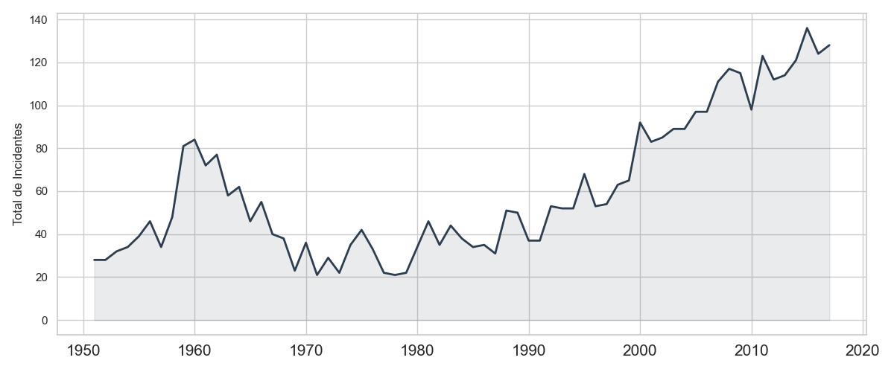
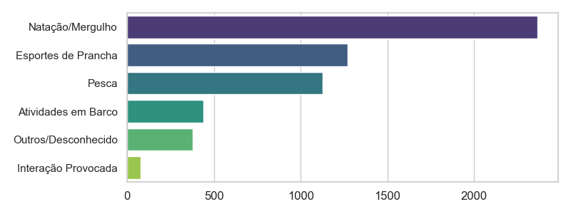
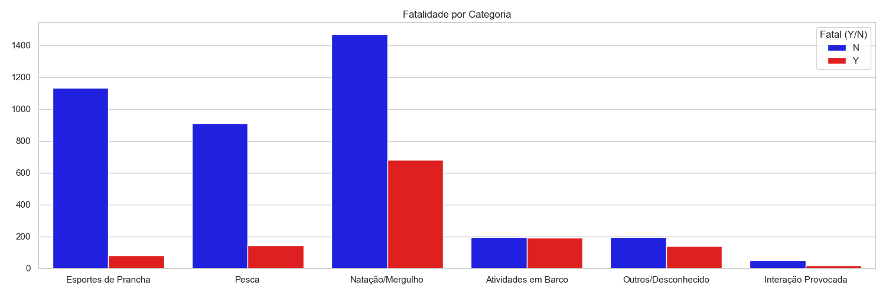
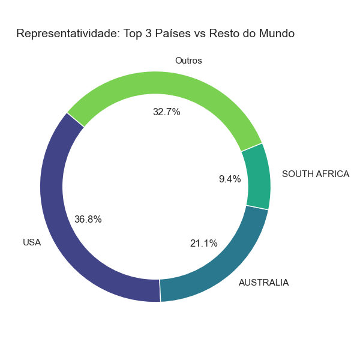

```
# Relatório de Ataques de Tubarão

## Resumo Executivo
Este relatório apresenta uma análise detalhada dos ataques de tubarão, com foco nas categorias de atividades, fatalidades, e a distribuição geográfica dos incidentes. Os dados revelam tendências preocupantes e áreas de alta incidência que requerem atenção.

## Análise Temporal
A análise temporal dos ataques de tubarão mostra um aumento significativo nos últimos anos, indicando uma necessidade urgente de medidas de segurança e conscientização. 


## Análise por Atividade
A distribuição dos ataques por atividade revela que a maioria dos incidentes ocorre durante atividades de natação e mergulho, seguidas por esportes de prancha e pesca.


## Análise de Fatalidade
A análise de fatalidades mostra que, embora a maioria dos ataques não resulte em morte, as atividades de natação e mergulho têm uma taxa de fatalidade alarmante.


## Análise Top 3 Países


## Detalhamento Geográfico: Tabelas com as 3 áreas mais afetadas para os 3 principais países.

### USA
| Área        | Volume |
|:-----------|-------:|
| Florida    |    970 |
| Hawaii     |    283 |
| California |    278 |

### AUSTRALIA
| Área              | Volume |
|:------------------|-------:|
| New South Wales   |    436 |
| Queensland        |    271 |
| Western Australia |    162 |

### SOUTH AFRICA
| Área                  | Volume |
|:----------------------|-------:|
| KwaZulu-Natal         |    190 |
| Western Cape Province |    181 |
| Eastern Cape Province |    150 |

## Conclusões
Os dados indicam que os ataques de tubarão estão se tornando mais frequentes, especialmente em áreas costeiras populares para atividades aquáticas. A Flórida, na USA, é a região mais afetada, seguida por áreas na Austrália e na África do Sul. É crucial implementar medidas de segurança e campanhas de conscientização para mitigar os riscos associados a essas atividades.
```